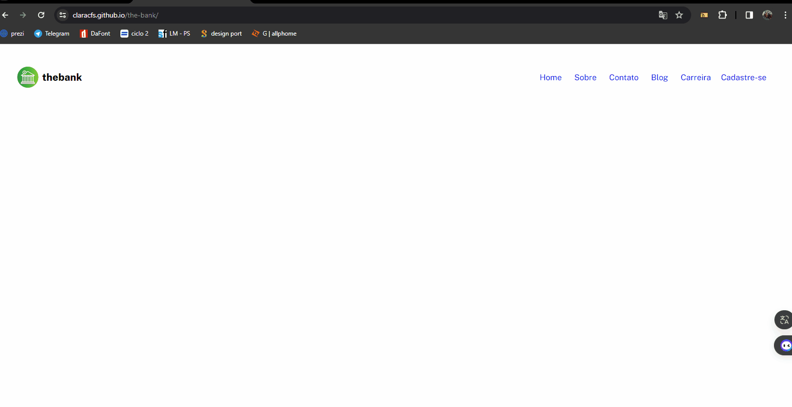

# The-bank
Esse é um exercício de fixação de conteúdo do módulo css avançado, do curso DevQuest. Seu objetivo era a criação de um cabeçalho simples que continha um menu de navegação.

## Tecnologias
As linguagens usadas p/ a programação desse site foram:
-HTML5
-CSS3

### O que eu aprendi?
Aprendi a usar melhor a tag "header" p/ faer cabeçalhos e também a estrutura usual de um cabeçalho HTML. Tabém tive fixação de conteúdo css no que di respeito aos flexbox.

### Imagem do projeto

